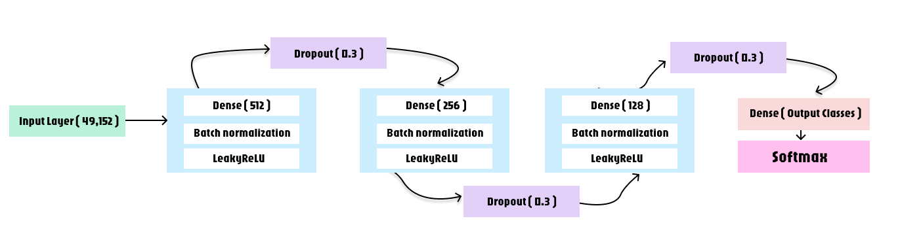
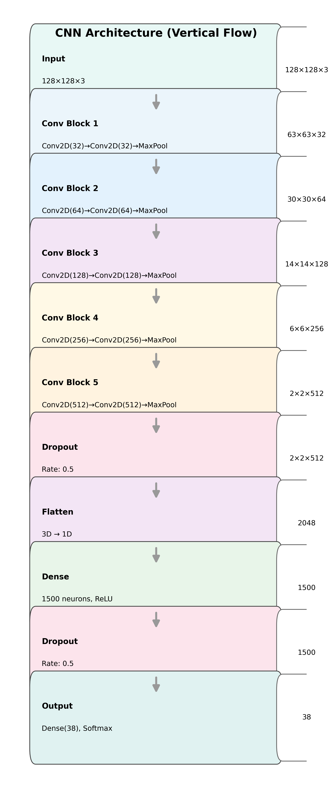

# 🧠 Deep Learning from Mathematical First Principles

**Neural networks built entirely from scratch using pure NumPy - no TensorFlow, PyTorch, or autograd.**

This implementation demonstrates deep understanding of backpropagation mathematics, optimization theory, and numerical computing by building production-ready neural networks from the ground up.

---

## 🎯 What Makes This Different

Most ML practitioners use high-level APIs without understanding the underlying mathematics. This project proves mastery by:

- **Im2col/Col2im convolution optimization** - Transforms 7-nested-loop convolution into matrix multiplication (~10x speedup)
- **Adam optimizer from scratch** - First & second moment estimation with bias correction, no framework dependencies
- **Custom data augmentation pipeline** - Manual implementation without ImageDataGenerator or tf.data
- **Production-level numerical stability** - Gradient clipping, weight normalization, label smoothing
---


---

## 🏗️ Architectures Implemented

### Artificial Neural Network (70% Accuracy)



**Configuration:**
- Parameters: ~26M trainable
- Training: 51 epochs, batch size 32
- Hardware: CPU-only 
- Result: 70.25% test accuracy

### Convolutional Neural Network (92% Accuracy)




**Configuration:**
- Parameters: ~8.1M trainable
- Dataset: 38 plant disease classes
- Training: 2 epochs (CPU crashed)
- Hardware: CPU-only
- Result: 92% accuracy

---

## 🔬 Technical Implementation Details

### Conv2D - Im2col Optimization

Naive convolution requires 7 nested loops (batch, output height, output width, channels, kernel height, kernel width, filters). Im2col transformation converts this into efficient matrix multiplication.

**Key insight:** Extract sliding windows into column matrix, perform single matrix multiplication, reshape back to output dimensions.

**Performance gain:** ~10x faster than naive implementation on large inputs.

### Adam Optimizer

Full implementation of adaptive moment estimation:
- Exponential moving average of gradients (first moment)
- Exponential moving average of squared gradients (second moment)
- Bias correction for initialization
- Per-parameter adaptive learning rates

**Hyperparameters:** β₁=0.9, β₂=0.999, ε=1e-8

### MaxPooling with Position Tracking

Stores boolean masks during forward pass indicating maximum value locations. During backpropagation, gradients are routed only to these positions.

**Memory efficient:** Only boolean masks stored, not full gradient matrices.

### Weight Normalization & Gradient Clipping

**Weight normalization:** Normalize weights by L2 norm before forward pass for stable training.

**Gradient clipping:** Clip gradient norm to threshold (1.0) to prevent exploding gradients.

Combined with He initialization (√(2/fan_in)) for ReLU networks.

### Custom Data Pipeline

**Preprocessing:**
- RGB → Resize(128×128) → Normalize[0,1] → Z-score standardization → CHW format

**Augmentation:**
- Random horizontal flip (50% probability)
- Random rotation (90°, 180°, 270°)
- Random brightness adjustment (±20%)
- Random contrast adjustment (±20%)
- Augmentation factor: 2× (doubles dataset)

**No external libraries:** All implemented manually without PyTorch DataLoader or tf.data.

---

## 📊 Results & Performance

### Accuracy Comparison

| Model | Accuracy | Parameters | Epochs | Hardware |
|-------|----------|------------|--------|----------|
| NumPy ANN | 70.25% | 26M | 51 | CPU |
| NumPy CNN | **92%** | 8M | 2* | CPU |

*Training stopped early due to CPU memory constraints

### Training Techniques Applied

- **Learning rate scheduling:** Cosine annealing with 2-epoch warmup
- **Label smoothing:** Factor of 0.1 to prevent overconfidence
- **Gradient clipping:** Norm threshold of 1.0
- **Early stopping:** Patience of 5 epochs on validation loss
- **Data augmentation:** 2× expansion with random transformations

---

## 💡 Key Challenges Overcome

### 1. CPU Memory Constraints
Training 8M parameter CNN crashed system after 2 epochs. Managed through careful batch processing, float32 precision, and memory-efficient operations.

### 2. Numerical Stability
Initial training exhibited exploding/vanishing gradients. Resolved with He initialization, gradient clipping, weight normalization, and proper epsilon values.

### 3. Convergence Speed
Pure NumPy training is slow compared to GPU frameworks. Im2col optimization and vectorized operations improved speed significantly.

### 4. Im2col Memory Usage
Intermediate column matrices consume significant RAM. Minimized through batching and avoiding unnecessary copies.

---

## 🚀 Usage

### Requirements

<pre>``` pip install -r requirements.txt ```</pre>

**Note:** No TensorFlow, PyTorch, or JAX required.


---

## 🎓 What This Demonstrates

### Mathematical Foundations
- Manual backpropagation through complex architectures
- Chain rule application across multiple layer types
- Gradient computation for convolution, pooling, dense layers

### Optimization Theory
- First-order (SGD) vs second-order (Adam) methods
- Learning rate scheduling strategies
- Regularization techniques (L2, dropout, batch normalization)

### Numerical Computing
- Memory layout optimization (CHW vs HWC)
- Vectorization for performance
- Numerical stability considerations

### Systems Thinking
- Training large models on consumer hardware
- Memory vs computation tradeoffs
- Batch size optimization for convergence

---


## 🔗 Related Projects

### TensorFlow Production Model (This Repository)

Located in `Tensorflow_Oreintation/` folder - optimized production model achieving **97% accuracy**:

**Key Features:**
- 5 convolutional blocks (32→64→128→256→512 filters)
- Advanced techniques: cosine annealing, label smoothing, early stopping
- 97% validation accuracy on 87,000+ images
- <5 second inference time
- Ready for production deployment


---

### Full-Stack Web Application

Complete production deployment with microservices architecture:

**🔗 Repository:** [Bloom Web Application](https://github.com/YOUR_USERNAME/bloom-web-app)

**Architecture:**
- **Frontend:** Vercel - Responsive UI with drag-drop upload & PDF generation
- **Backend:** Render - Node.js + Express + MongoDB (JWT auth, credit system)
- **ML API:** Hugging Face Spaces - Flask + TensorFlow + Docker (2GB RAM)

**Live Demo:** [https://bloom--plant-disease-detector.vercel.app](https://bloom--plant-disease-detector.vercel.app)

**Features:**
- Real-time disease detection with confidence scores
- User authentication and session management
- Credit-based usage system (0.04 credits per prediction)
- Automated PDF report generation
- CORS-secured API endpoints
- Deployed across 3 cloud platforms

---

### Comparison: NumPy vs TensorFlow

| Metric | NumPy (From Scratch) | TensorFlow (Production) |
|--------|----------------------|-------------------------|
| **Accuracy** | 92% | 97% |
| **Parameters** | 8.1M | 7.8M |
| **Training Time** | ~4 hours (2 epochs, CPU) | ~1 hour (50 epochs, GPU) |
| **Purpose** | Educational, mathematical proof | Production deployment |
| **Differentiator** | Im2col optimization, Adam from scratch | Framework optimizations, deployment-ready |

Both implementations validate the same architectural principles, demonstrating progression from mathematical foundations to production systems.

---

## 📄 License

MIT License

---
